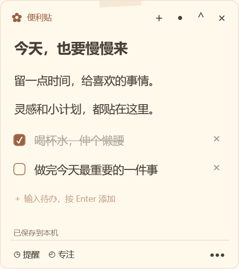
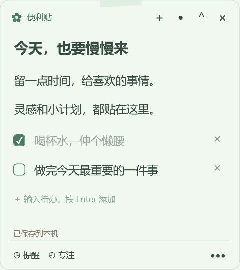
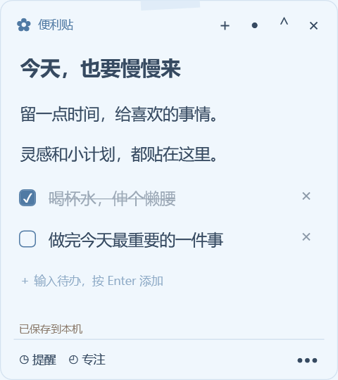
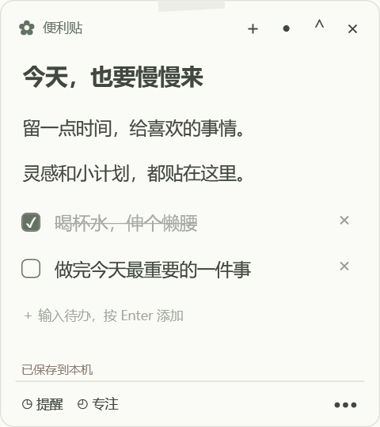

# Petal Notes · 花瓣便利贴

清新可爱的 Windows 原生桌面便利贴。C# / .NET 10 / WPF，自包含发布，无第三方应用框架、无联网服务、无账号。



## 下载与使用

前往 [最新版本](https://github.com/sonoko0404/petal-notes/releases/latest)，下载 `PetalNotes-Windows-x64-v1.0.0.zip`，完整解压后双击 **便利贴.exe**。免安装，不需要另装 .NET 运行环境。

[使用说明](docs/使用说明.md) · [验证记录](docs/验证记录.md)

## 功能

- 多张独立便签：拖动、缩放、置顶、折叠、隐藏与重启恢复。
- 正文和可勾选待办，自动保存，搜索与 30 天回收站。
- 指定时间／每日提醒，静音通知，稍后 5 分钟提醒。
- 全局番茄钟，支持关联便签、暂停、重置和自定义时长。
- 奶油手帐、薄荷清新、樱花粉、天空蓝、极简纸张五套主题，字体和字号可选。
- 托盘常驻、单实例、可选开机启动，数据仅保存在本机。

| 薄荷清新 | 樱花粉 | 天空蓝 | 极简纸张 |
| --- | --- | --- | --- |
|  |  |  |  |

## 验证与已知限制

Windows 11 x64 本机已完成 20 项核心测试、26 项 WPF 集成测试，以及 20 张便签持续 30 分钟观察。10 张普通便签空闲平均 CPU 约 0.080%，工作集约 204–208 MiB，**尚未达到最初 150 MB 的内存目标**。30 分钟观察中句柄数有小幅增长，原因待进一步分析。

真实中文输入法组合输入、多屏混合 DPI 热插拔、系统睡眠恢复、登录自启动和扬声器输出仍需对应场景补测。详见 [完整验证记录与原始数据](docs/验证记录.md)。

## 开发与构建

需要 Windows 11 x64 和 .NET 10 SDK。应用运行包不要求用户安装 SDK 或运行时。

```powershell
dotnet build StickyNotes/StickyNotes.csproj -c Release
dotnet run --project StickyNotes.Tests -c Release -- ./test-results
dotnet run --project StickyNotes.IntegrationTests -c Release -- ./integration-results
dotnet publish StickyNotes/StickyNotes.csproj -c Release -r win-x64 --self-contained true -p:PublishReadyToRun=true -o ./release
```

启动 `release/便利贴.exe`。分发时压缩整个 `release` 文件夹；不可只复制 exe，旁边的 DLL 和语言资源是自包含运行时的一部分。不对 WPF 进行 trimming。

## 结构

- `Models.cs`：可观察便签／待办数据、持久化状态，以及与 UI 无关的日程和计时计算。
- `ViewModels.cs`：便签编辑视图模型与命令。
- `Storage.cs`：状态快照、串行后台写入、原子替换、备份恢复与数据版本校验。
- `App.xaml.cs`：应用生命周期、单实例、托盘、自动保存、窗口管理与统一提醒调度。
- `NoteWindow.xaml`：便签视图；代码后置只处理窗口外观、位置、输入和菜单。
- `Windows.cs`：管理、设置、提醒、番茄钟和非抢焦点通知窗口。
- `Theme.cs`：主题、字体回退、原生圆角与屏幕工作区恢复。
- `Diagnostics.cs`：使用隔离数据的窗口回归与长期性能观察。
- `StickyNotes.Tests`：不依赖测试框架的核心逻辑回归检查，失败返回非零退出码。
- `StickyNotes.IntegrationTests`：启动真实 WPF 窗口，在隔离目录核对表单校验、设置、提醒卡片、暂停／重置、搜索／回收站和 20 窗口编辑缩放；结果写入 `integration-results.json`。

## 保存约定

默认数据目录为 `%LOCALAPPDATA%\BianLiTie`，`notes.json` 的 `SchemaVersion` 当前为 1。

UI 线程复制独立数据快照，后台线程串行执行 JSON 序列化、落盘及原子替换；便签模型和集合不会被后台线程直接访问。正文输入防抖 500 ms，失去焦点和正常退出主动保存。备份为 `notes.json.bak`；无效主文件另存 `.unreadable-*`，恢复备份时不会把损坏主文件提升为有效备份。未知版本拒绝覆盖。

默认主题／字体只影响新便签。已有便签保存各自外观。位置和大小为 WPF 逻辑单位，显示时使用原生显示器工作区校正可见范围。回收站保留 30 天，启动和每日维护时清理。设置开机启动使用当前用户的 `Run` 注册表项 `BianLiTie`，不需要管理员权限。

## 计时约定

提醒和运行中的番茄钟保存绝对时间。调度器只等待下一个截止时间或每日维护，不按秒轮询所有便签。番茄钟窗口仅在可见时刷新秒数；关闭窗口不停止计时。

到期提醒进入 `Pending` 状态，重复检查不会重复触发；关闭通知卡片只收起卡片，在托盘中可重新查看。完成每日提醒后排定下一个本地时间，稍后提醒保留每日配置。应用退出后不执行提醒，重新打开时汇总到期或尚未处理的提醒。睡眠恢复和系统时间变化会立即检查截止时间。系统时区改变后，已排定的下一次提醒保持原绝对时间，后续每日提醒使用新的本地时区。

专注默认 25 分钟，短休息 5 分钟，每 4 轮长休息 15 分钟。每阶段需要手动启动，不自动连续推进。修改时长对下一个阶段生效，重置可立即应用新时长。

## 隔离验证

```powershell
$env:STICKYNOTES_DATA_DIR = "$PWD/test-data"
./release/便利贴.exe --diagnostics --soak-minutes 30
```

只有显式指定 `STICKYNOTES_DATA_DIR` 才允许运行诊断。诊断会创建 20 张测试便签，核对窗口和提醒行为，每 15 秒记录进程 CPU、工作集、私有内存、句柄与 UI 调度延迟；输出在隔离数据目录的 `diagnostics` 子目录，完成后正常退出。

自动化工具通常不枚举隐藏于任务栏的工具窗口。测试便签编辑时可额外设置 `$env:STICKYNOTES_UI_TEST = '1'`，令测试便签显示于任务栏；仅有隔离数据目录时此开关生效，普通用户运行不受影响。此测试开关只改变任务栏可见性。

长期验证不要让机器休眠。非正常强制结束只用于隔离数据的崩溃恢复测试。输入法候选框、混合 DPI 多屏热插拔、实际睡眠恢复等需要对应硬件／人工补充验证，不能用逻辑测试替代。

## 分发

用户入口为 `便利贴.exe`。应用源码随交付提供，.NET 运行时及其组件的许可见运行包中 `licenses` 目录。
